# Project "Flask Shop"
### command structure / склад команди:
- Illya Shramko / Ілля Шрамко [github.com/IllyaShramko](https://github.com/IllyaShramko)
- Timur Koshel' / Тимур Кошель [github.com/kosheltimur](https://github.com/kosheltimur)
- Egor Galkin / Єгор Галкін [github.com/EgorGalkinORG](https://github.com/EgorGalkinORG)
- David Petrenko / Давид Петренко [github.com/Davidptn](https://github.com/Davidptn)
____
# Main Information of project / Основна Інформація про проект:
### Flask Shop project can do / Flask Shop project може робити:
- Start up / Запускатися
- Process Authorizations, Registrations and record them in the database / Опрацьовувати Авторизації, Реєстрації та записувати їх у базі даних
- Add the products which we bought on the shop web page to the cart / Додавати продукти, які ми купили на вкладці shop, до корзини
- Edit and add products on the admin web page / Редагувати та додавати продукти на веб-сторінці admin
- Work with cookies-files / Працювати з кукі-файлами
- After placing an order, send's message on creator and customer email / Після оформлення замовлення, відправляється повідомлення на email замовника та власника сайту
____
### Why this project is useful / Чому цей проект корисний:
- The project has many functions such as / У проекта є багато функцій такі як:
    - Registration / Реєстрація
    - Authorizations / Авторизація
    - Add products to cart / Додавання продуктів до корзини
    - Edit and Add products / Змінювати та додавати продукти
    - Send messages on email / Відправляти повідомлення на email

# How correctly run the project / Як правильно запустити проект:
### Libraries which you need for run the project / Модулі, які вам знадобляться для роботи проекту:
#### 1. Library: os, but you unneed in installation, since it is installed by default / Модулі: os, але його не потрібно встановлювати, так як він за замовчуванням встановлен
____
#### 2. Library flask, it is the master library of project / Модуль flask, це основний модуль проекту, тому він обов'язковий

In console Windows:
```
pip install flask 
```
In terminal MacOS:
```
pip3 install flask
```
#### 3. Library flask_sqlalchemy. this Library needed for create & edit database / Модуль flask_sqlalchemy. цей модуль потрібен для створювання та керуванням базой даних, тому він обов'язковий

In console Windows:
```
pip install flask_sqlalchemy 
```
In terminal MacOS:
```
pip3 install flask_sqlalchemy
```
____
#### 4. Library flask_migrate. This library needed for help to create databases (migrations) / Модуль flask_migrate. Цей модуль потрібен для допомоги створювання бази даних (міграцій) 

In console Windows:
```
pip install flask_migrate
```
In terminal MacOS:
```
pip3 install flask_migrate
```
____
#### 5. Library flask_login. This library needed for authorization, so he is important / Модуль flask_login. цей модуль потрібен для правильної роботи авторизації, тому він обов'язковий

In console Windows:
```
pip install flask_login
```
In terminal MacOS:
```
pip3 install flask_login
```
____
#### 6. Library flask_mail. This library is needed to send messages to email / Модуль flask_migrate. Цей модуль потрібен для відправки повідомлень на email 

In console Windows:
```
pip install flask_mail
```
In terminal MacOS:
```
pip3 install flask_mail
```
____
#### 7. Library jinja. This library needed for better work with .html files and .py, but this library does not require installation, because it installed when we install flask / Модуль flask_login. цей модуль потрібен для кращого зв'язка файлів .html та .py, але цей модуль не потребує інсталяції, так як його було інстальовоно разом з flask
____
#### 8. Library telebot. This library needed for run telegram bot / Модуль telebot. Цей модуль потрібен для роботи телеграм боту

In console Windows:
```
pip install telebot
```
In terminal MacOS:
```
pip3 install telebot
```
____
#### Installing all of the libraries, which needed for install for run project / Встановлення всіх модулів, які потребують встановлення для старту проекту
In console Windows:
```
pip install flask flask_migrate flask_login flask_mail flask_sqlalchemy telebot
```
In terminal MacOS:
```
pip3 install flask flask_migrate flask_login flask_mail flask_sqlalchemy telebot
```

# Main Structure of project / Основна структура проекту:

```mermaid
graph TD;
    flask-Shop-main-->project;
    flask-Shop-main-->home_page;
    flask-Shop-main-->login_page;
    flask-Shop-main-->registration_page;
    flask-Shop-main-->shop_page;
    flask-Shop-main-->cart_page;
    flask-Shop-main-->admin_page;
    flask-Shop-main-->bot_app;
    
    
    project-->templates;
    project-->login_manager.py;
    project-->__init__.py;
    project-->settings.py;
    project-->urls.py;
    project-->flask_config.py;
    templates-->base.html;

    home_page-->home_page/__init__.py;
    home_page-->home_page/app.py;
    home_page-->home_page/views.py;
    home_page-->home_page/templates;
    home_page/templates-->home.html;
    home_page-->home_page/static;
    home_page/static-->home_page/css;
    home_page/css-->home.css;

    shop_page-->shop_page/__init__.py;
    shop_page-->shop_page/app.py;
    shop_page-->shop_page/views.py;
    shop_page-->shop_page/models.py;
    shop_page-->shop_page/templates;
    shop_page/templates-->shop.html;
    shop_page-->shop_page/static;
    shop_page/static-->shop_page/imgs;
    shop_page/static-->shop_page/js;
    shop_page/js-->save_cookies.js;
    shop_page/static-->shop_page/css;
    shop_page/css-->shop_page/shop.css;

    registration_page-->registration_page/__init__.py;
    registration_page-->registration_page/app.py;
    registration_page-->rigistration_page/views.py;
    registration_page-->registration_page/templates;
    registration_page/templates-->registration.html;
    registration_page-->registration_page/static
    registration_page/static-->registration_page/css;
    registration_page/css-->register.css;

    login_page-->login_page/__init__.py;
    login_page-->login_page/app.py;
    login_page-->login_page/views.py;
    login_page-->login_page/templates;
    login_page/templates-->login.html;
    login_page-->login_page/static;
    login_page/static-->login_page/css;
    login_page/css-->login.css
    
    cart_page-->cart_page/__init__.py;
    cart_page-->cart_page/app.py;
    cart_page-->cart_page/views.py;
    cart_page-->cart_page/templates;
    cart_page/templates-->cart.html;
    cart_page-->cart_page/static;
    cart_page/static-->cart_page/imgs;
    cart_page/static-->cart_page/css;
    cart_page/css-->cart.css;
    cart_page/static-->cart_page/js;
    cart_page/js-->write_cookeies.js;

    bot_app-->main;

    admin_page-->admin_page/__init__.py;
    admin_page-->admin_page/app.py;
    admin_page-->admin_page/views.py;
    admin_page-->admin_page/templates;
    admin_page/templates-->admin.html;
    admin_page-->admin_page/static;
    admin_page/static-->admin_page/js;
    admin_page/static-->admin_page/edit.js;
    admin_page/static-->admin_page/css;
    admin_page/css-->admin.css;

    flask-Shop-main-->manage.py;
``` 

### Creating & structure of the project folder / Створення та структура папки project:
- File `settings.py` is needed to run the project and create & edit the database / Файл `settings.py` потрібен для запуску проекта та створення й редагування бази даних
- Code / Код:
```python
# Імпортуємо модулі, які нам потрібні для роботи цього файлу
import flask, flask_sqlalchemy, flask_migrate, os
# Створюємо головний додаток та задаємо властивості
project = flask.Flask(
    import_name="project",
    template_folder="templates",
    instance_path= os.path.abspath(__file__ + "/..")
)
# Робимо конфіг для нашого проекту, для правильного створювання бази даних
project.config["SQLALCHEMY_DATABASE_URI"] = "sqlite:///data.db"
# Створюємо зміну бази даних
DATABASE = flask_sqlalchemy.SQLAlchemy(app= project)
# Створюємо зміну міграцій для бази даних
migrate = flask_migrate.Migrate(app= project, db= DATABASE)
```
- File `urls.py` is needed to registration of blueprints and link building / Файл `urls.py` потрібен для реєстрування blueprint-ів та створення посилань
- Code / Код:
```python
# Імпортуємо нашу зміну project з файлу settings
from .settings import project
# Імпортуємо всі наші додатки, які були створені на основі Blueprint
import home_page, registration_page, login_page, shop_page, cart_page, admin_page
# Додаємо/створюємо посилання на основі Blueprint з файлів, які були імпортовані вище
home_page.home_page.add_url_rule(
    rule = "/",
    view_func = home_page.render_home_page,
    methods = ["GET", "POST"]
)
# Додаємо/створюємо посилання на основі Blueprint з файлів, які були імпортовані вище
registration_page.register_page.add_url_rule(
    rule= "/registration/",
    view_func= registration_page.render_registration,
    methods = ["GET", "POST"]
)
# Додаємо/створюємо посилання на основі Blueprint з файлів, які були імпортовані вище
login_page.login_page.add_url_rule(
    rule= "/login/",
    view_func= login_page.render_login_page,
    methods = ["GET", "POST"]
)
# Додаємо/створюємо посилання на основі Blueprint з файлів, які були імпортовані вище
shop_page.shop_page.add_url_rule(
    rule= "/shop/",
    view_func= shop_page.render_shop_page,
    methods = ["GET", "POST"]
)
# Додаємо/створюємо посилання на основі Blueprint з файлів, які були імпортовані вище
cart_page.cart_page.add_url_rule(
    rule= "/cart/",
    view_func= cart_page.render_cart_page,
    methods = ["GET", "POST"]
)
# Додаємо/створюємо посилання на основі Blueprint з файлів, які були імпортовані вище
admin_page.admin_page.add_url_rule(
    rule= "/admin/",
    view_func= admin_page.render_admin_page,
    methods = ["GET", "POST"]
)
# Реєструємо blueprint register_page
project.register_blueprint(blueprint= registration_page.register_page)
# Реєструємо blueprint login_page
project.register_blueprint(blueprint= login_page.login_page)
# Реєструємо blueprint shop_page
project.register_blueprint(blueprint= shop_page.shop_page)
# Реєструємо blueprint cart_page
project.register_blueprint(blueprint= cart_page.cart_page)
# Реєструємо blueprint home_page
project.register_blueprint(blueprint = home_page.home_page)
# Реєструємо blueprint admin_page
project.register_blueprint(blueprint= admin_page.admin_page)
```
- File `login_manager.py` is needed to login users / Файл `login_manager.py` потрібен для входу користувачів
- Code / Код:
```python
# Імпортуємо модуль flask_login
import flask_login
# Імпортуємо нашу зміну project з файлу settings
from .settings import project
# Імпортуємо модель User з файла models
from registration_page.models import User

# Створюємо секретний ключ
project.secret_key = "key"

# Создаємо зміну login_manager від класу LoginManager
login_manager = flask_login.LoginManager(app= project)
# Для login_manager задаємо init_app з зміною app
login_manager.init_app(app= project)
# Створюємо декоратор
@login_manager.user_loader
# Створюємо функцію load_user та передаємо id
def load_user(id):
    # Повертаємо рядок з бази даних та таблиці user, який співпадає з id
    return User.query.get(ident= id)
```
- File `flask_config.py` is needed to config project for send messages on email / Файл `flask_config.py` потрібен для конфігурації нашого проекту для відправки повідомлень на email
- Code / Код:
```python
# Імпортуємо модуль flask_mail
import flask_mail
# З файлу settings імпортуємо project
from .settings import project
# Задаємо нашому проекту конфігурацію поштового сервера
project.config["MAIL_SERVER"] = "smtp.gmail.com"
# Задаємо нашому проекту конфігурацію порту
project.config["PORT"] = 587
# Задаємо нашому проекту конфігурацію шифрування
project.config["MAIL_USE_TLS"] = True
# Задаємо нашому проекту конфігурацію username в якій записуємо пошту адресанта
project.config["MAIL_USERNAME"] = "123illya123123r@gmail.com"
# Задаємо нашому проекту конфігурацію паролю додатка
project.config["MAIL_PASSWORD"] = "yshv yhmu lozm faji"
# Створюємо зміну на основі класу Mail
mail = flask_mail.Mail(project)
```
- Folder `templates` is needed to keep .html files / Папка `templates` потрібна для збереження .html файлів
- File `base.html` is needed to give other .html files a basic page template / Файл `base.html` потрібен для щоб надати іншім .html файлів базовий шаблон сторінки
```html
<html lang="en">
    <head>
        <meta charset="UTF-8">
        <meta name="viewport" content="width=device-width, initial-scale=1.0">
        <title></title>
        

        
    </head>
    <body>
        

        
    </body>
</html>
```
____
### Creating & structure app home_page / Створення та структура додатку home_page:
- File `app.py` is needed to create & keep app home_page / Файл `app.py` потрібен для створення та збереження нашого додатка home_page
- Code / Код:
```python
# Імпортуємо модуль flask
import flask
# Створюємо зміну home_page на основі Blueprint
home_page = flask.Blueprint(
    # Задаємо параметри
    name= "home",
    import_name= "app",
    template_folder= "home_page/templates",
    static_url_path= "/home/",
    static_folder="home_page/static"
)
```
- File `views.py` is needed to show .html file home_page/ Файл `views.py` потрібен для відображення .html файла, який зберігається в папці templates.
- Code / Код:
```python
# Імпортуємо модуль flask
import flask
# З модуля flask_login імпортуємо зміну current user
from flask_login import current_user
# З Папки.файлу імпортуємо модель User
from registration_page.models import User
# Створюємо зміну is_admin, яка буде зберігати значення Bool
is_admin = False
# Створюємо функцію для відображення нашого додатка
def render_home_page():
    global is_admin
    try:
        user1 = current_user.login
    except Exception as e:
        print(e)
        user1 = "1"
    if current_user.is_authenticated:
        is_admin = current_user.is_admin
    return flask.render_template(
        template_name_or_list= "home.html",
        is_auth = current_user.is_authenticated,
        user = user1, is_admin = is_admin
    )   
```
- Folder `templates` is needed to keep .html files / Папка `templates` потрібна для збереження .html файлів
- File `login.html` is needed to create html file.  Needed to import the base template,  Needed for set the file name,  Needed to import the css file,  Needed to set the page content. The form in this file is needed to be able to authorize on the site / Файл `login.html` потрібен для створення html файлу.  Потрібен для імпортування базового шаблону,  Потрібен для ім'я файлу,  Потрібен для імпортування файла css,  Потрібен для задовання контенту сторінки.
```html



Home



    <link rel="stylesheet" href="{{ url_for('home.static', filename = '/css/home.css' ) }}">



    
    <div class="reg-log">
        <a href="/registration/">REGISTRATION</a>
        <a href="/login/">AUTHORIZATION</a>
    </div>
    <h1>
        Home Page
    </h1>

    
        <div class="already-auth">
            <div class="pages">
                <a href="/" class="on-page">HOME</a>
                <a href="/shop/">SHOP</a>
                <a href="/cart/">CART</a>
                <a href="/contacts/">CONTACTS</a>
                
                    <a href="/admin/">ADMIN</a>
                
            </div> 
            <h2>{{user}}</h2>
        </div>

        <h1>
            Home Page
        </h1>
    

```


____
### Creating & structure app registration_page / Створення та структура додатку registration_page:
- File `app.py` is needed to create & keep app registration_page / Файл `app.py` потрібен для створення та збереження нашого додатка registration_page
- Code / Код:
```python
# Імпортуємо модуль flask
import flask

# Створюємо зміну register_page на основі Blueprint
register_page = flask.Blueprint(
    # Задаємо параметри
    name= "registration",
    import_name="app",
    template_folder= "registration_page/templates",
    static_url_path= "/registration/",
    static_folder="registration_page/static"
)
```
- File `models.py` is needed to create model of database / Файл `models.py` потрібен для створення моделі бази даних
- Code / Код:
```python
# Імпортуємо базу даних з файла settings
from project.settings import DATABASE
# Імпортуємо клас UserMixin з модулю flask_login
from flask_login import UserMixin

# Створюємо клас User
class User(DATABASE.Model, UserMixin):
    # Створюємо стовпчик id з параметром primary_key = True
    id = DATABASE.Column(DATABASE.Integer(), primary_key = True)
    
    # Створюємо стовпчики login, email, password, is_admin для реєстрації та авторізації
    login = DATABASE.Column(DATABASE.String(25), nullable = False)
    email = DATABASE.Column(DATABASE.String(50), nullable = False)
    password = DATABASE.Column(DATABASE.String(20), nullable = False)
    is_admin = DATABASE.Column(DATABASE.Boolean)
    
    # Створюємо функцію __repr__ та передаємо в її зміну self
    def __repr__(self) -> str:
        # Виводимо ім'я користувача
        return f"login: {self.login}"
```
- File `views.py` is needed to show html of registration_page / Файл `views.py` потрібен для відображення html registration_page
- Code / Код:
```python
# Імпортуємо модуль flask
import flask
# Імпортуємо клас User з файлу models
from .models import User
# Імпортуємо базу даних з файла settings
from project.settings import DATABASE
# Імпортуємо модуль flask_login
import flask_login

# Створюємо функцію render_registration
def render_registration():
    confirmed = False
    # Перевіряємо що метод є POST
    if flask.request.method == 'POST':
        user = User(
            login = flask.request.form['login'],
            email = flask.request.form['email'],
            password = flask.request.form['password'],
            is_admin = False
        )
        try:
            
            DATABASE.session.add(user)
            DATABASE.session.commit()
            confirmed = True
        except:
            return "Не вдалося створити користувача"  
    print(confirmed)
    return flask.render_template(
        template_name_or_list='register.html', 
        show_confirmed = confirmed)
```
- Folder `templates` is needed to keep .html files / Папка `templates` потрібна для збереження .html файлів
- File `register.html` is needed to create html file / Файл `register.html` потрібен для створення html файлу.  Потрібен для імпортування базового шаблону,  Потрібен для ім'я файлу,  Потрібен для імпортування файла css,  Потрібен для задовання контенту сторінки, form method="post" Потрібена для створення полей для реєстрування.
- Code / Код:
```html



Registration



    <link rel="stylesheet" href="{{ url_for('registration.static', filename= '/css/register.css') }}">




<a class="reg" href="/registration/">REGISTRATION</a>
    <form method="post">
        <p>Login</p>
        <input type="text" name = "login" class="input_log">
        <p>Email</p>
        <input type="email" name = "email" class="input_email">
        <p>Password</p>
        <input type="password" name = "password" class="input_password">
        <p>Confirm Password</p>
        <input type="password" name = "password" class="input_password">
        <button type="submit">Send</button>
    </form>
    
        <div class="bg1"></div>
        <div>
            <h1>CONFIRMED</h1>
            <a href="/login/">AUTHORIZATION</a>
        </div>
    

```

____
### Creating & structure app login_page / Створення та структура додатку login_page:
- File `app.py` is needed to create & keep app login_page / Файл `app.py` потрібен для створення та збереження нашого додатка login_page
- Code / Код:
```python
# Імпортуємо модуль flask
import flask
# Створюємо зміну login_page на основі Blueprint
login_page = flask.Blueprint(
    name= "login",
    import_name= "app",
    template_folder= "login_page/templates",
    static_url_path= "/login/",
    static_folder="login_page/static"
)
```
- File `views.py` is needed to show .html file in folder templates login_page / Файл `views.py` потрібен для відображення .html файла, який зберігається в папці templates.
- Code / Код:
```python
# Імпортуємо модулі flask і flask_login
import flask, flask_login
# З Папки.файлу імпортуємо User
from registration_page.models import User
# Створюємо функцію відображення .html файлу з папки templates
def render_login_page():
    # Створюємо умову при якій буде перевірятися method, який був відправлений від користувача
    if flask.request.method == "POST":
        for user in User.query.filter_by(login = flask.request.form['login']):
            if user.password == flask.request.form['password']:
                flask_login.login_user(user)
                return flask.redirect('/')
        return "невірний пароль"
    return flask.render_template('login.html')
```
- Folder `templates` is needed to keep .html files / Папка `templates` потрібна для збереження .html файлів
- File `login.html` is needed to create html file   Needed to import the base template,  Needed for the file name,  Needed to import the css file,  Needed to set the page content. The form in this file is needed to be able to authorize on the site / Файл `login.html` потрібен для створення html файлу.  Потрібен для імпортування базового шаблону,  Потрібен для ім'я файлу,  Потрібен для імпортування файла css,  Потрібен для задовання контенту сторінки. form в цьому файлі потрібна для того щоб можно було авторизуватися на сайті  

```html



login



    <link rel="stylesheet" href="{{ url_for('login.static', filename= '/css/login.css') }}">



    <a href="/login/">AUTHORIZATION</a>
    <form method="post">
        <p>Login</p>
        <input type="text" name="login">
        <p>Password</p>
        <input type="password" name="password">
        <button type="submit">Send</button>
    </form>

```
____
### Creating & structure app bot_app / Створення та структура додатку bot_app:
- File `main.py` is needed to create telegram bot / Файл `main.py` потрібен для створення телеграм боту
- Code / Код:
```python
# Імпортуємо telebot
import telebot
# Імпортуємо sqlite3
import sqlite3
# Імпортуємо os
import os

# Задаємо токін для бота
bot = telebot.TeleBot(token= "7423716714:AAFXsmLt8SICOR1mKAbqclKpm9CyhO_11cs")
# Створюємо кнопку
button = telebot.types.InlineKeyboardButton(text="GET USERS", callback_data = "get")
# Створюємо клавіатуру для кнопки
keyboard = telebot.types.InlineKeyboardMarkup(
    keyboard= [
        [button]
    ]
)
# Створюємо кнопку
button1 = telebot.types.InlineKeyboardButton(text="CHECK", callback_data = "check")
# Створюємо клавіатуру для кнопки
keyboard1 = telebot.types.InlineKeyboardMarkup(
    keyboard= [
        [button1]
    ]
)
# Створюємо кнопку
button_products_1 = telebot.types.InlineKeyboardButton(text="GET PRODUCTS", callback_data= "get_products")
# Створюємо кнопку
button_products_2 = telebot.types.InlineKeyboardButton(text="ADD PRODUCT", callback_data= "add_product")
# Створюємо клавіатуру для кнопки
keyboard_products = telebot.types.InlineKeyboardMarkup(
    keyboard= [
        [button_products_1, button_products_2]
    ]
)


# Створюємо зміну USERS_ID
USERS_ID = "5"
# Створюємо зміну PRODUCTS_ID
PRODUCTS_ID = "7"
# Створюємо зміну step1
step1 = "start"

# Створюємо список product з полями для створення продукту
product = {
    "name":"",
    "price":"",
    "discount":"",
    "description":"",
    "count":""
}
# Створюємо функцію name в яку передаємо message
def name(message):
    global step1,product
    product['name'] = message.text
    step1 = "image"
# Створюємо функцію image в яку передаємо message
def image(message):
    global step1,product
    with open(os.path.abspath(__file__ + f"/../../shop_page/static/imgs/{product['name']}.png"), "wb") as file:
        file.write(bot.download_file(bot.get_file(message.photo[-1].file_id).file_path))
    step1 = "price"

# Створюємо функцію price в яку передаємо message
def price(message):
    global step1,product
    product['price'] = message.text
    step1 = "discount"
# Створюємо функцію discount в яку передаємо message
def discount(message):
    global step1,product
    product['discount'] = message.text
    step1 = "description"
# Створюємо функцію description в яку передаємо message
def description(message):
    global step1,product
    product['description'] = message.text
    step1 = "count"
# Створюємо функцію count в яку передаємо message
def count(message):
    global step1,product
    product['count'] = message.text
    step1 = "final"
adding_new_product = False
# Створюємо декоратор
@bot.message_handler(commands=['start'])
# Створюємо функцію start в яку передаємо message
def start(message):
    # Перевіряємо айді користувачив
    if str(message.reply_to_message.id) == USERS_ID:
        bot.send_message(message.chat.id, 'Get all users' , reply_markup=keyboard)
    # Перевіряємо айді продуктів
    elif str(message.reply_to_message.id) == PRODUCTS_ID:
        bot.send_message(message.chat.id, 'Manual edit products' , reply_markup=keyboard_products)
    print(message.reply_to_message.id)

# Створюємо декоратор
@bot.callback_query_handler(lambda callback: True)
# Створюємо функцію get_users в яку передаємо callback
def get_users(callback):
    # Робимо зміни step1, product, adding_new_product, keyboard1 глобальними
    global step1, product, adding_new_product, keyboard1
    adding_new_product = True
    database = sqlite3.connect(os.path.abspath(__file__ + '/../../project/data.db'))
    cursor = database.cursor()
    # Перевіряємо що 
    if callback.data == 'get':
        cursor.execute('SELECT * FROM user')
        list_users = cursor.fetchall()
        # Записуємо користувачив з list_users
        for user in list_users:
            if int(user[4]):
                is_admin = "True"
            else:
                is_admin = "False"
            # Створюємо видалиння користувача
            delete_user = telebot.types.InlineKeyboardButton(text= "DELETE USER", callback_data= f"delete-{user[0]}")
            # П
            if user[4]:
                # Створюємо кнопку видалиння адміна
                remove_user = telebot.types.InlineKeyboardButton(text= "REMOVE ADMIN", callback_data= f"change_admin-{user[0]}-{user[4]}")
            else:
                # Створюємо кнопку призначення адміна
                remove_user = telebot.types.InlineKeyboardButton(text= "ADD ADMIN", callback_data= f"change_admin-{user[0]}-{user[4]}")

            # Створюємо клавіатуру для кнопок
            keyboard1 = telebot.types.InlineKeyboardMarkup(
                keyboard= [
                    [delete_user, remove_user]
                ]
            )
            # 
            bot.send_message(callback.message.chat.id, f'ID: {user[0]}\nNAME: {user[1]}\nPASSWORD: {user[3]}\nADMIN: {is_admin}', reply_markup= keyboard1)
    # Перевіряємо що
    elif callback.data.split('-')[0] == "delete":
        cursor.execute(f"DELETE FROM user WHERE id = {callback.data.split('-')[1]}")
    # Перевіряємо що
    elif callback.data.split("-")[0] == "change_admin":
        # Перевіряємо що
        if int(callback.data.split("-")[2]):
            cursor.execute(f"UPDATE user SET is_admin = 0 where id = {callback.data.split('-')[1]}")
        else:
            cursor.execute(f"UPDATE user SET is_admin = 1 where id = {callback.data.split('-')[1]}")
    # Перевіряємо що
    elif callback.data == "get_products":
        cursor.execute('SELECT * FROM product')
        list_users = cursor.fetchall()
        #
        for product in list_users:
            bot.send_message(callback.message.chat.id, f"ID: {product[0]}\nNAME: {product[1]}\nPRICE: {product[2]}\nDISCOUNT: {product[3]}")
    # Перевіряємо що
    elif callback.data == "add_product" or adding_new_product:
        adding_new_product = True
        # Перевіряємо що
        if step1 == "start":
            bot.send_message(callback.message.chat.id, f"Enter name of new product", reply_markup=keyboard1)
            bot.register_next_step_handler(callback.message,name)
        
        # Перевіряємо що
        elif step1 == "image" and callback.data == "check":
            bot.send_message(callback.message.chat.id, f"Upload image of new product", reply_markup=keyboard1)
            bot.register_next_step_handler(callback.message,image)
        
        # Перевіряємо що
        elif step1 == "price" and callback.data == "check":
            bot.send_message(callback.message.chat.id, f"Enter price of new product", reply_markup=keyboard1)
            bot.register_next_step_handler(callback.message,price)

        # Перевіряємо що
        elif step1 == "discount" and callback.data == "check":
            bot.send_message(callback.message.chat.id, f"Enter discount of new product", reply_markup=keyboard1)
            bot.register_next_step_handler(callback.message,discount)
        # Перевіряємо що
        elif step1 == "description" and callback.data == "check":
            bot.send_message(callback.message.chat.id, f"Enter description of new product", reply_markup=keyboard1)
            bot.register_next_step_handler(callback.message,description)
        # Перевіряємо що
        elif step1 == "count" and callback.data == "check":
            bot.send_message(callback.message.chat.id, f"Enter count of new product", reply_markup=keyboard1)
            bot.register_next_step_handler(callback.message,count)
        # Перевіряємо що
        elif step1 == "final" and callback.data == "check":
            product['count'] = callback.message.text
            bot.send_message(callback.message.chat.id, f"Writing...")
            cursor.execute('INSERT INTO product (name, price, discount, capacity1, capacity2, capacity3) Values (?,?,?,?,?,?)', (product["name"],product["price"],product["discount"], "64", "128", "256")) 
            database.commit()
            product = {
                "name":"",
                "price":"",
                "discount":"",
                "description":"",
                "count":""
            }
            step1 = "start"
            adding_new_product = False
            bot.send_message(callback.message.chat.id, f"congratulations! Your product was created!\nYou can see your product on website!")


    #
    database.commit()
    database.close()
    adding_new_product = False
#
bot.infinity_polling()
```
____
### Creating & structure app shop_page / Створення та структура додатку shop_page:
- File `app.py` is needed to create & keep app shop_page / Файл `app.py` потрібен для створення та збереження нашого додатка shop_page
- Code / Код:
```python
# імпортуємо фласк
import flask
# Створюємо зміну shop_page на основі Blueprint
shop_page = flask.Blueprint(
    name= "shop",
    import_name= "app",
    template_folder= "shop_page/templates",
    static_url_path= "/shop/",
    static_folder="shop_page/static"
)
```
- File `views.py` is needed to show .html file in folder templates login_page / Файл `views.py` потрібен для відображення .html файла, який зберігається в папці templates.
- Code / Код:
```python
# імпортуємо flask, flask_login  
import flask, flask_login
# з project.settings імпортумо DATABASE
from project.settings import DATABASE
# з registration_page.models імпортумо User
from registration_page.models import User
# з models імпортуємо Product
from .models import Product
value = 0
value_tf = False
# 
def render_shop_page():
    global value_tf, value
    is_admin = False
    if flask.request.method == "POST":
        value += 1
        if not value_tf:
            value_tf = True
    is_admin = flask_login.current_user.is_admin

    return flask.render_template(
        template_name_or_list= "shop.html",
        user = flask_login.current_user.login,
        value1 = value,
        valuetf = value_tf,
        products = Product.query.all(),
        int = int,
        is_admin = is_admin
    )
```
- File `models.py` is needed to create model/table of database / Файл `models.py` потрібен для створення моделі/таблиці в базі даних
- Code / Код:
```python
# З Папки.файлу імпортуємо DATABASE
from project.settings import DATABASE
# Створюємо модель Product
class Product(DATABASE.Model):
    # Створюємо стовпчик id з параметром primary_key = True
    id = DATABASE.Column(DATABASE.Integer, primary_key = True)
    # Створюємо стовпчик name
    name = DATABASE.Column(DATABASE.String(50), primary_key = False)
    # Створюємо стовпчик price
    price = DATABASE.Column(DATABASE.Integer, primary_key = False)
    # Створюємо стовпчик discount
    discount = DATABASE.Column(DATABASE.Integer, primary_key = False)
    # Створюємо стовпчик capacity1
    capacity1 = DATABASE.Column(DATABASE.String(20), primary_key = False)
    # Створюємо стовпчик capacity1
    capacity2 = DATABASE.Column(DATABASE.String(20), primary_key = False)
    # Створюємо стовпчик capacity1
    capacity3 = DATABASE.Column(DATABASE.String(20), primary_key = False)

    def __repr__(self):
        return f"id: {self.id}; name: {self.name};"
```
- Folder `templates` is needed to keep .html files / Папка `templates` потрібна для збереження .html файлів
- File `login.html` is needed to create html file   Needed to import the base template,  Needed for the file name,  Needed to import the css file,  Needed to set the page content. The form to buy products / Файл `login.html` потрібен для створення html файлу.  Потрібен для імпортування базового шаблону,  Потрібен для ім'я файлу,  Потрібен для імпортування файла css,  Потрібен для задовання контенту сторінки. form в цьому файлі потрібна для обробки додовання товарів у корзину
```html



Shop



    <!-- script потрібно для підключення .js файлів -->
    <script src="{{ url_for('shop.static', filename='js/save_cookies.js') }}" defer></script>
    <link rel="stylesheet" href="{{ url_for('shop.static', filename= '/css/shop.css') }}">



    <div class="already-auth">
        <div class="pages">
            <a href="/">HOME</a>
            <a href="/shop/" class="on-page">SHOP</a>
            <a href="/cart/">CART</a>
            <a href="/contacts/">CONTACTS</a>
            
                <a href="/admin/">ADMIN</a>
            
            
                <div class="cart-value">
                    <h3>{{value1}}</h3>
                </div>
            
        </div> 
        <h2>{{user}}</h2>
    </div>
    <div class="products">
        
            
                <div class="product">
                        
                    
                    <div class="description">                        
                        <p class="title">{{ product.name }}</p>
                        <p class="cost-original">{{ product.price }} грн</p>
                        <p class="discount">Знижка {{ product.discount }}%</p>
                        <p class="total-cost">{{ product.price - int(product.price / 100 * product.discount) }} грн</p>
                        <form method="post">
                            <button type="submit" id="{{product.id}}" class="buy">КУПИТИ</button>
                        </form>
                        <p class="capacity">ЄМНІСТЬ:</p>                           
                        <div class="options-capacity">
                            <p class="selected1">{{product.capacity1}}</p>
                            <p class="not-selected1">{{product.capacity2}}</p>
                            <p class="not-selected12">{{product.capacity3}}</p>
                        </div>
                    </div>
                </div>
            
    </div>



```
- Folder `static/js` is needed to keep .js files / Папка `static/js` потрібна для збереження .js файлів
- File `save_cookies.js` is needed to write some data in cookies / Файл `save_cookies.js`потрібен для записування інформації в кукі-файли
- Code / Код:
```js
// Створюємо константу, список listButtons в яку записуємо усі кнопки с класом .buy
const listButtons = document.querySelectorAll('.buy')
// Створюємо константу, список listButtonsEditTitle в яку записуємо усі кнопки с класом .edit-title
const listButtonsEditTitle = document.querySelectorAll('.edit-title')
// Створюємо константу, список listTitles в яку записуємо усі тексти с класом .title
const listTitles = document.querySelectorAll(".title")
// Створюємо константу, список listButtonsEditPrice в яку записуємо усі кнопки с класом .edit-price
const listButtonsEditPrice = document.querySelectorAll('.edit-price')
// Створюємо константу, список listPrices в яку записуємо усі кнопки с тексти .cost-original
const listPrices = document.querySelectorAll(".cost-original")
// Створюємо константу, список listButtonsEditDiscount в яку записуємо усі кнопки с класом .edit-discount
const listButtonsEditDiscount = document.querySelectorAll('.edit-discount')
// Створюємо константу, список listDiscounts в яку записуємо усі кнопки с тексти .discount
const listDiscounts = document.querySelectorAll(".discount")
// Створюємо константу, список listTotalPrice в яку записуємо усі кнопки с тексти .total-cost
const listTotalPrice = document.querySelectorAll(".total-cost")
// Перебіраємо listButtonsEditTitle та створюємо івент с кликом
for (let count = 0; count < listButtonsEditTitle.length; count++) {
    let button = listButtonsEditTitle[count]
    button.addEventListener(
        type = 'click',
        listener = function (event) {
            listTitles[count].textContent = prompt("Укажіть нову назву для товару")
        }
    )
}
// Перебіраємо listButtonsEditPrice та створюємо івент с кликом
for (let count = 0; count < listButtonsEditPrice.length; count++) {
    let button = listButtonsEditPrice[count]
    button.addEventListener(
        type = 'click',
        listener = function (event) {
            listPrices[count].textContent = prompt("Укажіть нову ціну для товару") + ' грн'
        }
    )
}
// Перебіраємо listButtonsEditDiscount та створюємо івент с кликом
for (let count = 0; count < listButtonsEditDiscount.length; count++) {
    let button = listButtonsEditDiscount[count]
    button.addEventListener(
        type = 'click',
        listener = function (event) {
            listDiscounts[count].textContent = "Знижка " + prompt("Укажіть нову знижку для товару") + "%"
        }
    )
}
// Перебіраємо listButtons та створюємо івент с кликом
for (let count = 0; count < listButtons.length; count++) {
    let button = listButtons[count]
    button.addEventListener(
        type = 'click',
        listener = function (event) {
            if (document.cookie == ''){
                document.cookie = `products = ${button.id}; path = / `
            }
            else{
                product_id = document.cookie.split('=')[1]
                document.cookie = `products = ${product_id} ${button.id}; path = / `
            }
        }
    )
}
```
_____
### Creating & structure app admin_page / Створення та структура додатку admin_page:
- File `app.py` is needed to create & keep app admin_page / Файл `app.py` потрібен для створення та збереження нашого додатка admin_page
- Code / Код:
```python
# імпортуємо flask
import flask
# Створюємо зміну admin_page на основі Blueprint
admin_page = flask.Blueprint(
    name= "admin",
    import_name= "admin_page",
    template_folder= "templates",
    static_url_path= "/admin/",
    static_folder="static"
)
```
- File `views.py` is needed to show .html file in folder admin_page/templates  / Файл `views.py` потрібен для відображення .html файла, який зберігається в папці admin_page/templates.
- Code / Код:
```python
# імпорт flask, flask_login, os
import flask, flask_login, os
# з project.settings імпортуємо DATABASE
from project.settings import DATABASE
# з registration_page.models імпортуємо User
from registration_page.models import User
# з shop_page.models імпортуємо Product
from shop_page.models import Product
value = 0
value_tf = False
# Функція обробляє POST-запити, які надсилаються на адміністративну сторінку.
def render_admin_page():
    if flask.request.method == "POST":
        try:
            if flask.request.form.get('del'):
                product_id = int(flask.request.form['del'])
                print(product_id)
                product_del = Product.query.get(product_id)

                if Product.query.get(product_id) != None:
                    DATABASE.session.delete(product_del)
                    DATABASE.session.commit() 
                    os.remove(os.path.abspath(__file__ + f"/../../shop_page/static/imgs/{product_del.name}.png")) 
            elif flask.request.form.get('submit-change'):
                # Якщо у формі є поле 'submit-change', виконується оновлення продукту. Тип оновлення визначається першою частиною значення поля 'submit-change'.
                list_values = flask.request.form.get('submit-change').split('-')
                print(list_values)
                product_name = Product.query.get(int(list_values[1]))
                # Оновлення зображення
                if list_values[0] == 'image':
                    os.remove(os.path.abspath(__file__ + f"/../../shop_page/static/imgs/{product_name.name}.png"))
                    image_save = flask.request.files['image']
                    image_save.save(os.path.abspath(__file__ + f"/../../shop_page/static/imgs/{product_name.name}.png"))
                # Оновлення назви
                elif list_values[0] == 'name':
                    get_name = flask.request.form.get('name')
                    
                    absolute_path = os.path.abspath(__file__ + f'/../../shop_page/static/imgs') 
                    os.rename(src= absolute_path + f'/{product_name.name}.png', dst= absolute_path + f'/{get_name}.png')
                    product_name.name = get_name
                    DATABASE.session.commit()   
                # Оновлення ціни
                elif list_values[0] == 'price':
                    get_price = flask.request.form.get('price')
                    product_name.price = get_price
                    DATABASE.session.commit()   
                # Оновлення знижки
                elif list_values[0] == 'discount':
                    get_discount = flask.request.form.get('discount')
                    product_name.discount = get_discount
                    DATABASE.session.commit()
                # Додавання нового продукту
                elif list_values[0] == "newProduct":
                    next = True
                    for product in Product.query.all():
                        if product.name == flask.request.form['newProductName']:
                            if product.price == int(flask.request.form['newProductPrice']):
                                if product.discount == int(flask.request.form['newProductDiscount']):
                                    next = False
                    if next:
                        new_product = Product(
                            name = flask.request.form['newProductName'],
                            price = int(flask.request.form['newProductPrice']),
                            discount = int(flask.request.form['newProductDiscount']),
                            capacity1 =  "128 Гб",
                            capacity2 =  "256 Гб",
                            capacity3 =  "512 Гб"
                        )
                        DATABASE.session.add(new_product)
                        DATABASE.session.commit()
                        print(flask.request.files['newProductImage'])
                        image_save = flask.request.files['newProductImage']
                        
                        image_save.save(os.path.abspath(__file__ + f"/../../shop_page/static/imgs/{new_product.name}.png"))
        except Exception as e:
            print(e)
    is_admin = flask_login.current_user.is_admin

    return flask.render_template(
        template_name_or_list= "admin.html",
        user = flask_login.current_user.login,
        products = Product.query.all(),
        int = int, is_admin = is_admin
    )

```
- Folder `templates` is needed to keep .html files / Папка `templates` потрібна для збереження .html файлів
- File `admin.html` is needed to create html file   Needed to import the base template,  Needed for the file name,  Needed to import the css file,  Needed to set the page content. The form to edit/add products / Файл `admin.html` потрібен для створення html файлу.  Потрібен для імпортування базового шаблону,  Потрібен для ім'я файлу,  Потрібен для імпортування файла css,  Потрібен для задовання контенту сторінки. form в цьому файлі потрібна для редагування/додавання продуктів
- Code / код:
```html



Admin



    <script src="{{ url_for('admin.static', filename='js/edit.js') }}" defer></script>
    <link rel="stylesheet" href="{{ url_for('admin.static', filename= '/css/admin.css') }}">



    <div class="already-auth">
        <div class="pages">
            <a href="/">HOME</a>
            <a href="/shop/">SHOP</a>
            <a href="/cart/">CART</a>
            <a href="/contacts/">CONTACTS</a>
            
                <a href="/admin/" class="on-page">ADMIN</a>
            
            
                <div class="cart-value">
                    <h3>{{value1}}</h3>
                </div>
            
        </div> 
        <h2>{{user}}</h2>
    </div>
    <div class="create-product">
        <p class="add-image-product-p">Додати продукт</p>
        <button class="add-product-b">+</button>
    </div>
    <div class="products">
        
            <div class="product">
                    
                
                <button class="edit-image" id="{{ product.id }}"></button>
                
                <div class="description">
                    <p class="title">{{ product.name }}</p>
                    <button class="edit-title" id="{{ product.id }}"></button>
                    
                    <p class="cost-original">{{ product.price }} грн</p>
                    <button class="edit-price" id="{{ product.id }}"></button>
                    
                    <p class="discount">Знижка {{ product.discount }}%</p>
                    <button class="edit-discount" id="{{ product.id }}"></button>
                    
                    <p class="total-cost">{{ product.price - int(product.price / 100 * product.discount) }} грн</p>

                    
                    <form method="post">
                        <button type="submit" id="1" class="buy">КУПИТИ</button>
                    </form>
                    
                    <p class="capacity">ЄМНІСТЬ:</p>   
                    <div class="options-capacity">
                        <p class="selected1">{{product.capacity1}}</p>
                        <p class="not-selected1">{{product.capacity2}}</p>
                        <p class="not-selected12">{{product.capacity3}}</p>
                        
                        <div class="in-stock">
                            <p class="in-stock-p"></p>
                        </div>
                    </div>
                    <form method="post">
                        <button class="delete-product" name="del" value="{{product.id}}">Видалити товар</button>
                    </form>
                </div>
            </div>
        
        
    </div>
    <div class= "modal-window" style="display: none;">
        <form method="post" enctype="multipart/form-data" class="modal-form" style="height: 350px;">
            <p class="input-text" style="display: flex;"></p>
            <input type="" name="" accept="" class="input-data" placeholder="" style="display: none;">
            <!--  -->

            <p class="text-data-new image-input" style="display: none;">image product:</p>
            <input type="file" name="newProductImage" accept="image/*" class="input-data-new image-input" style="display: none;">

            <p class="text-data-new" style="display: none;">name product:</p>
            <input type="text" name="newProductName"class="input-data-new" style="display: none;">

            <p class="text-data-new" style="display: none;">description product:</p>
            <textarea type="text" name="newProductDescription" class="input-data-new" style="display: none;"></textarea>

            <p class="text-data-new" style="display: none;">price product:</p>
            <input type="text" name="newProductPrice" class="input-data-new" style="display: none;">

            <p class="text-data-new" style="display: none;">discount product:</p>
            <input type="text" name="newProductDiscount" class="input-data-new" style="display: none;">

            <p class="text-data-new" style="display: none;">count product:</p>
            <input type="text" name="newProductCount" class="input-data-new" style="display: none;">

            <button type="submit" name="submit-change" class="submit-change" value="">SEND</button>
        </form>
    </div>


```
- Folder `static/js` is needed to keep .js files / Папка `static/js` потрібна для збереження .js файлів
- File `edit.js` is needed to write some data in cookies / Файл `edit.js`потрібен для записування інформації в кукі-файли
- Code / Код:
```js
// Отримуємо всі кнопки редагування зображень с классу edit-image
let listOfButtonsImages = document.querySelectorAll('.edit-image')
// Редагування зображення продукту
for (let count = 0; count < listOfButtonsImages.length; count++){
    let button = listOfButtonsImages[count]

    button.addEventListener(
        type = 'click',
        listener = (event) => {
            document.querySelector('.modal-window').style.display = 'flex'
            let input_text = document.querySelector(".input-text")
            input_text.textContent = "Change image:"
            input_text.style.top = 65
            let input_image = document.querySelector(".input-data")
            input_image.type = "file"
            input_image.name = "image"
            input_image.accept = "image/*"
            input_image.style.display = "flex"

            // input_image.hidden = false
            document.querySelector('.submit-change').value = `image-${button.id}`
        }
    )  
}
// Отримуємо всі кнопки редагування назв с классу edit-title
let listOfButtonsNames = document.querySelectorAll('.edit-title')
// Показуємо модальне вікно
for (let count = 0; count < listOfButtonsNames.length; count++){
    let button = listOfButtonsNames[count]
    console.log(14124134)
    button.addEventListener(
        type = 'click',
        listener = (event) => {
            document.querySelector('.modal-window').style.display = 'flex'
            let input_text = document.querySelector(".input-text")
            input_text.textContent = "Change text:"
            input_text.style.top = 65
            let input_image = document.querySelector(".input-data")
            input_image.type = "text"
            input_image.name = "name"
            input_image.style.display = "flex"
            document.querySelector('.submit-change').value = `name-${button.id}`
        }
    )
}
// Отримуємо всі кнопки редагування цін с классу edit-price
let listOfButtonsPrices = document.querySelectorAll('.edit-price')
// Показуємо модальне вікно
for (let count = 0; count < listOfButtonsPrices.length; count++){
    let button = listOfButtonsPrices[count]
    console.log(14124134)
    button.addEventListener(
        type = 'click',
        listener = (event) => {
            document.querySelector('.modal-window').style.display = 'flex'
            let input_text = document.querySelector(".input-text")
            input_text.textContent = "Change Price:"
            input_text.style.top = 65
            let input_image = document.querySelector(".input-data")
            input_image.type = "text"
            input_image.name = "price"
            input_image.style.display = "flex"
            document.querySelector('.submit-change').value = `price-${button.id}`
        }
    )
}
// Отримуємо всі кнопки редагування знижок с классу edit-discount
let listOfButtonsDiscounts = document.querySelectorAll('.edit-discount')
// Показуємо модальне вікно
for (let count = 0; count < listOfButtonsDiscounts.length; count++){
    let button = listOfButtonsDiscounts[count]
    console.log(14124134)
    button.addEventListener(
        type = 'click',
        listener = (event) => {
            document.querySelector('.modal-window').style.display = 'flex'
            document.querySelector('.modal-form').style.height = '350px'
            document.querySelector('.modal-form').style.display = 'flex'
            let input_text = document.querySelector(".input-text")
            input_text.textContent = "Change Discount:"
            input_text.style.top = 65
            let input_image = document.querySelector(".input-data")
            input_image.type = "text"
            input_image.name = "discount"
            input_image.style.display = "flex"
            document.querySelector('.submit-change').value = `discount-${button.id}`
        }
    )
}
// Отримуємо кнопку для додавання нового продукту с классу add-product-b
let NewProductButton = document.querySelector(".add-product-b")
// Показуємо модальне вікно
NewProductButton.addEventListener(
    type = "click",
    listener = (event) => {
        let elements = document.querySelectorAll(".input-data-new")
        document.querySelector('.modal-window').style.display = 'flex'
        document.querySelector('.modal-form').style.height = '750px'
        document.querySelector('.modal-form').style.display = 'flex'
        for (let count = 0; count < elements.length; count++) {
            let element = elements[count]
            element.style.display = "flex"
        }
        
        let elementsp = document.querySelectorAll(".text-data-new")
        let y = 0
        for (let count = 0; count < elementsp.length; count++) {
            let element = elementsp[count]
            element.style.display = "flex"
            element.style.top = y
            y += 109
        }
        document.querySelector('.submit-change').value = `newProduct-0`

    }
)
```
### Creating & structure app cart_page / Створення та структура додатку cart_page:
- File `app.py` is needed to create & keep app cart_page / Файл `app.py` потрібен для створення та збереження нашого додатка cart_page
- Code / Код:
```python
# Імпортуємо flask
import flask
# Створюємо зміну cart_page на основі Blueprint
cart_page = flask.Blueprint(
    name= "cart",
    import_name= "app",
    template_folder= "cart_page/templates",
    static_url_path= "/cart/",
    static_folder="cart_page/static"
)
```
- File `views.py` is needed to show .html file in folder cart_page/templates  / Файл `views.py` потрібен для відображення .html файла, який зберігається в папці cart_page/templates.
- Code / Код:
```python
# Імпротруємо flask та flask_login
import flask, flask_login
# Імпротруємо User з файла models
from registration_page.models import User
# Імпротруємо DATABASE з файла 
from project.settings import DATABASE
# Імпротруємо Cart з файла models
from .models import Cart
# Імпротруємо Product з файла models
from shop_page.models import Product
# Імпротруємо mail з файла flask_config 
from project.flask_config import mail
# Імпротруємо модуль flask_mail
import flask_mail
count_of_products= None
valuetf= None
# Створюємо функцію render_cart_page
def render_cart_page():
    global count_of_products, valuetf
    check_basket = False
    valuetf = True
    # Перевіряємо що метод є POST
    if flask.request.method == "POST":
        list_id_products = flask.request.cookies.get('products').split(' ')
        list_products = []
        list_same_id = []
        for id_product in list_id_products:
            for product in Product.query.all():
                if id_product not in list_same_id:
                    if str(id_product) == str(product.id):
                        list_products.append(product.name)
                    list_same_id.append(id_product)
                    print(list_products)
        count_of_products = [[]]
        for cart_product in list_products:
            count_of_products[-1].append(0)
            for product in Product.query.all():
                if cart_product == product.name:
                    count_of_products1 = count_of_products[int(product.id)-1]
                    count_of_products1[0] = "1"
                    count_of_products1 = count_of_products[int(product.id)-1]
                    count_of_products1.append('')
                    count_of_products1[1] = product.name
                    count_of_products.append(count_of_products1)
        print(count_of_products)
        
        # Відправляємо повідомлення про замовлення
        text_message1 = f"Hello Admin. Your customer {flask.request.form['orderName']} {flask.request.form['orderSurname']} maked order, he's cart has: "
        for product in count_of_products:
            print(product)
            text_message1 += ',' + str(product[0]) + " " + product[-1]
            print(text_message1)
        try:
            text_message = flask_mail.Message(
                subject = "Hello Admin. Your customer maked order",
                body= text_message1,
                recipients = ['123illya123123r@gmail.com'],
                sender= flask.request.form['orderEmail']
            )
            mail.send(text_message)
        except Exception as e:
            print(e)
            print("Анлак")
        # Створюємо зміну new_product
        new_product = Cart(
            name = flask.request.form['orderName'],
            surname = flask.request.form['orderSurname'],
            phone_number = flask.request.form['orderNumber'],
            email = flask.request.form['orderEmail'],
            city = flask.request.form['orderCity'],
            wishes = flask.request.form['orderWishes'],
            cart = count_of_products[1][1],
            status = "in proccess",
        )
        # Зберегаємо базу даних
        DATABASE.session.add(new_product)
        DATABASE.session.commit() 

        
    if flask.request.cookies:
        try:
            list_id_products = flask.request.cookies.get('products').split(' ')
            list_products = []
            list_same_id = []
            for id_product in list_id_products:
                for product in Product.query.all():
                    if id_product not in list_same_id:
                        if str(id_product) == str(product.id):
                            list_products.append([])
                            list_products[-1].append(str(list_id_products.count(id_product)))
                            list_products[-1].append(product.name)
                            list_products[-1].append(product.price)
                            list_products[-1].append(product.discount)
                            list_same_id.append(id_product)
            check_basket = True
        except Exception as e:
            print(e)
            list_products = [[0, "None"]]
        # Перевіряємо призначення адміна
        is_admin = flask_login.current_user.is_admin
        return flask.render_template(
            template_name_or_list = "cart.html",
            products = list_products,
            check_basket = check_basket, 
            count_of_products = count_of_products,
            valuetf = valuetf,
            user = flask_login.current_user.login, is_admin = is_admin
        )
    else:
        return flask.render_template(template_name_or_list = "cart.html", check_basket = check_basket)
```

- File `models.py` is needed to create model/table of database / Файл `models.py` потрібен для створення моделі/таблиці в базі даних
- Code / Код:

```python
# З Папки.файлу імпортуємо DATABASE
from project.settings import DATABASE
# Створюємо модель/таблицю Cart
class Cart(DATABASE.Model):
    # Створюємо стовпчик id з параметром primary_key = True
    id = DATABASE.Column(DATABASE.Integer, primary_key = True)
    # Створюємо стовпчик name
    name = DATABASE.Column(DATABASE.Text, primary_key = False)
    # Створюємо стовпчик surname
    surname = DATABASE.Column(DATABASE.Text, primary_key = False)
    # Створюємо стовпчик phone_number
    phone_number = DATABASE.Column(DATABASE.Integer, primary_key = False)
    # Створюємо стовпчик email
    email = DATABASE.Column(DATABASE.Text, primary_key = False)
    # Створюємо стовпчик city
    city = DATABASE.Column(DATABASE.Text, primary_key = False)
    # Створюємо стовпчик wishes
    wishes = DATABASE.Column(DATABASE.Text, primary_key = False)
    # Створюємо стовпчик cart
    cart = DATABASE.Column(DATABASE.Text, primary_key = False)
    # Створюємо стовпчик status
    status = DATABASE.Column(DATABASE.Text, primary_key = False)
    
    def __repr__(self):
        return f"id: {self.id}; name: {self.login}"
```
- Folder `templates` is needed to keep .html files / Папка `templates` потрібна для збереження .html файлів
- File `admin.html` is needed to create html file   Needed to import the base template,  Needed for the file name,  Needed to import the css file,  Needed to set the page content. The form to buy products / Файл `admin.html` потрібен для створення html файлу.  Потрібен для імпортування базового шаблону,  Потрібен для ім'я файлу,  Потрібен для імпортування файла css,  Потрібен для задовання контенту сторінки. form в цьому файлі потрібна для покупки продуктів
```html




Basket



    <script src="{{ url_for('cart.static', filename='js/write_cookies.js') }}" defer></script>

    <link rel="stylesheet" href="{{ url_for('cart.static', filename= '/css/cart.css') }}">



    <div class="already-auth">
        <div class="pages">
            <a href="/">HOME</a>
            <a href="/shop/" class="shop-page">SHOP</a>
            <a href="/cart/">CART</a>
            <a href="/contacts/">CONTACTS</a>
            
                <a href="/admin/">ADMIN</a>
            
            


            
                <div class="cart-value1">
                    <h3 class="cart-value">0</h3>
                </div>
            
        </div> 
        <h2>{{user}}</h2>
    
        </div>
            <div class="basket-menu">
                <div class="basket-of-products">
                    
                        <div class="product-in-basket">
                            
                            <h1 class="name-of-product">{{ product[-1] }}</h1>
                            <div class="counter-of-product">    
                                <button class="minus-count" id="1">-</button>
                                <p class="count-of-product" id="1">0</p>
                                <button class="plus-count" id="1">+</button>
                            </div>
                            <p class="price-of-product">{{ product[2] }}</p>
                        </div>
                    
                </div>
            </div>
        </div>
        <div class = "order">
            <button class="continie-order">Перейти до оформлення</button>
            <div class="original-price">
                <p class="original-count"></p>
                <h4 class="original-price-p"></h4>
            </div>
            <div class="discount">
                <p class="discount-p1">Знижка</p>
                <h4 class="discount-p">0 грн</h4>
            </div>
            <div class="total-price">
                <p class="ttl-prc-p1">Загальна сума</p>
                <h4 class="total-price-p"></h4>
            </div>
        </div>
        <div class= "modal-window" style="display: none;">
            <form method="post" enctype="multipart/form-data" class="modal-form" style="height: 1050px;">
                <p class="title-order">оформлення замовлення</p>
                <p class="name-order text-data-new">Ім'я:</p>
                <input type="text" name="orderName" class="orderName">
    
                <p class="surname-order text-data-new">Прізвище:</p>
                <input type="text" name="orderSurname"class="orderSurname">
    
                <p class="number-order text-data-new">Номер телефона замовника:</p>
                <input type="text" name="orderNumber" class="orderNumber">
                
                <p class="email-order text-data-new">Email замовника:</p>
                <input type="email" name="orderEmail" class="orderEmail">
                
                <p class="city-order text-data-new" >Місто отримувача:</p>
                <input type="text" name="orderCity" class="orderCity">
                
                <p class="nova-poshta-order text-data-new">Відділення нової пошти:</p>
                <input type="text" name="orderPoshta" class="orderPoshta">
                
                <p class="wishes-order text-data-new" >Додаткові побажання:</p>
                <textarea type="text" name="orderWishes" class="orderWishes"></textarea>
                
                <button type="submit" name="submit-change" class="submit-change" value="">SEND</button>
            </form>
        </div>
    
    <div class="basket-menu">
        <h1>Ваша корзина порожня...</h1>
    </div>
    



```
- Folder `static/js` is needed to keep .js files / Папка `static/js` потрібна для збереження .js файлів
- File `write_cookies.js` is needed to edit some data / Файл `write_cookies.js`потрібен для редагування інформації
```js
//  Отримують всі кнопки збільшення та зменшення кількості товарів відповідно.
const listbuttonsplus = document.querySelectorAll(".plus-count")
const listbuttonsminus = document.querySelectorAll(".minus-count")
// містить всі елементи, що відображають кількість товарів.
const listp = document.querySelectorAll(".count-of-product")
// використовуються для відображення відповідної інформації на сторінці.
let h4_count_prdc = document.querySelector(".original-count")
let h4_org_prc = document.querySelector(".original-price-p")
let h4_disc = document.querySelector(".discount-p")
let h4_ttl_prc = document.querySelector(".total-price-p")
let cartValue = document.querySelector(".cart-value")


// Ці змінні використовуються для зберігання загальної вартості різних товарів і знижок.
let price_iPhones = 0
let price_Vivos = 0
let total_price = 0
let discount = 0

// Ця функція розраховує загальну вартість та знижку на основі даних з файлів cookie. Вона також оновлює відповідні елементи на сторінці.
function counter_price (){
    let cookies1 = document.cookie.split('=')[1].split(' ')
    if (cookies1.length == 1) {
        h4_count_prdc.textContent = `${cookies1.length} товар на суму`
    }
    else {
        if (cookies1.length == 4) {
            h4_count_prdc.textContent = `${cookies1.length}-и товари на суму`
        }
        else {
            h4_count_prdc.textContent = `${cookies1.length} товарів на суму`
        }
    }
    price_iPhones = 0
    price_Vivos = 0
    total_price = 0
    discount = 0
    for (let count = 0; count < cookies1.length; count++) {
        if (cookies1[count] == "1") {
            price_iPhones += 40009
        }
        else {
            price_Vivos += 3095
        }
    }
    for (let count = 0; count < cookies1.length; count++) {
        if (cookies1[count] == "1") {
            discount += 9990
        }
        else {
            discount += 1904
        }
    }

    total_price = `${price_Vivos + price_iPhones} грн`
    h4_org_prc.textContent = total_price
    h4_disc.textContent = `${discount} грн`
    h4_ttl_prc.textContent = total_price
    console.log(total_price)
}
// Ця функція оновлює відображення кількості товарів на сторінці на основі даних з файлів cookie.
function counter1 (id) {
    let cookies = document.cookie.split('=')[1].split(' ')
    let data = 0
    for (let count = 0; count < cookies.length; count++) {
        if (cookies[count] == id) {
            data++
        }
    }
    try {
        listp[id-1].textContent = data 
    }
    catch {
        listp[id-2].textContent = data 
    }
}
// Цей блок додає обробники подій для кнопок збільшення кількості товарів. При натисканні на кнопку, дані зберігаються у файлі cookie та оновлюються елементи на сторінці.
for (let count = 0; count < listbuttonsplus.length; count++) {
    let button = listbuttonsplus[count]
    button.addEventListener(
        type = "click",
        listener = function (event) {
            // Якщо записів до cookie раніше не проводились то даємо перший запис
            if (document.cookie == ''){
                // Ми створюємо файл cookie  з назвою products та додаємо динамічно значення натиснутої кнопки
                document.cookie = `products = ${button.id}; path = / `
                let count11 = document.cookie.split("=")
                cartValue.textContent = count11[1].split(' ').length
                counter_price()                
            }
            else{
                // Отримуємо попередньо записані дані в cookie (products)
                product_id = document.cookie.split('=')[1]
                // перезаписуємо cookie додаючи значення нової натиснутої кнопки
                document.cookie = `products = ${product_id} ${button.id}; path = / `
                counter1(id= button.id)
                let count11 = document.cookie.split("=")
                cartValue.textContent = count11[1].split(' ').length

                counter_price()         
            }
        }
    )
}
// Цей блок додає обробники подій для кнопок зменшення кількості товарів. При натисканні на кнопку, відповідний товар видаляється з файлу cookie і оновлюються відповідні елементи на сторінці.
for (let count = 0; count < listbuttonsminus.length; count++) {
    let button = listbuttonsminus[count]
    button.addEventListener(
        type = "click",
        listener = function (event) {
            // Якщо записів до cookie раніше не проводились то даємо перший запис
            if (document.cookie != ''){
                product_id = document.cookie.split('=')[1].split(' ')
                product_id.splice(product_id.indexOf(button.id), 1)
                document.cookie = `products = ${product_id.join(" ")}; path = / `
                counter1(id= button.id)
                let count11 = document.cookie.split("=")
                cartValue.textContent = count11[1].split(' ').length
                counter_price()         
            }
        }
    )
}
// Цей код виконуються при завантаженні сторінки, щоб встановити початкові значення кількості товарів та загальної вартості.
counter_price()    
let count11 = document.cookie.split("=")
cartValue.textContent = count11[1].split(' ').length
// Ця умова виконуються при завантаженні сторінки, щоб встановити початкові значення кількості товарів та загальної вартості.
let OrderButton = document.querySelector(".continie-order")
OrderButton.addEventListener(
    type = "click",
    listener = (event) => {
        document.querySelector('.modal-window').style.display = 'flex'

        let elementsp = document.querySelectorAll(".text-data-new")
        let y = 30
        for (let count = 0; count < elementsp.length; count++) {
            let element = elementsp[count]
            element.style.display = "flex"
            element.style.top = y
            y += 125
        }

    }
)
```
# Conclusion / Висновок:
This project was not easy, but it taught us how to do it:
1. Create web applications
2. work with flask, flask_sqlalchemy, flask_migrate, flask_login, flask_mail
3. Learned how to work with .js files
4. learn to better understand .css files
5. Make the right project structure

Цей проект був не простим, але завдяки йому ми навчились робити:
1. Робити веб-додатки
2. працювати з flask, flask_sqlalchemy, flask_migrate, flask_login, flask_mail
3. Навчились працювати з .js файлами
4. навчились краще розуміти .css файли
5. Робити правильну структуру проекта

Many thanks to Egor Galkin, David Petrenko and Timur Koshel for their great work
Велика подяка Галкіну Єгору, Петренко Давиду і Кошелю Тимурові за гарну роботу